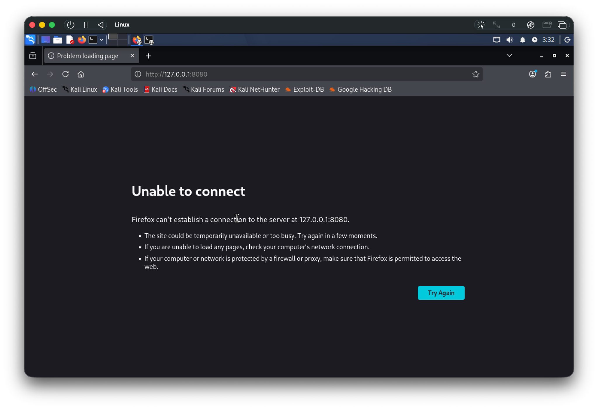
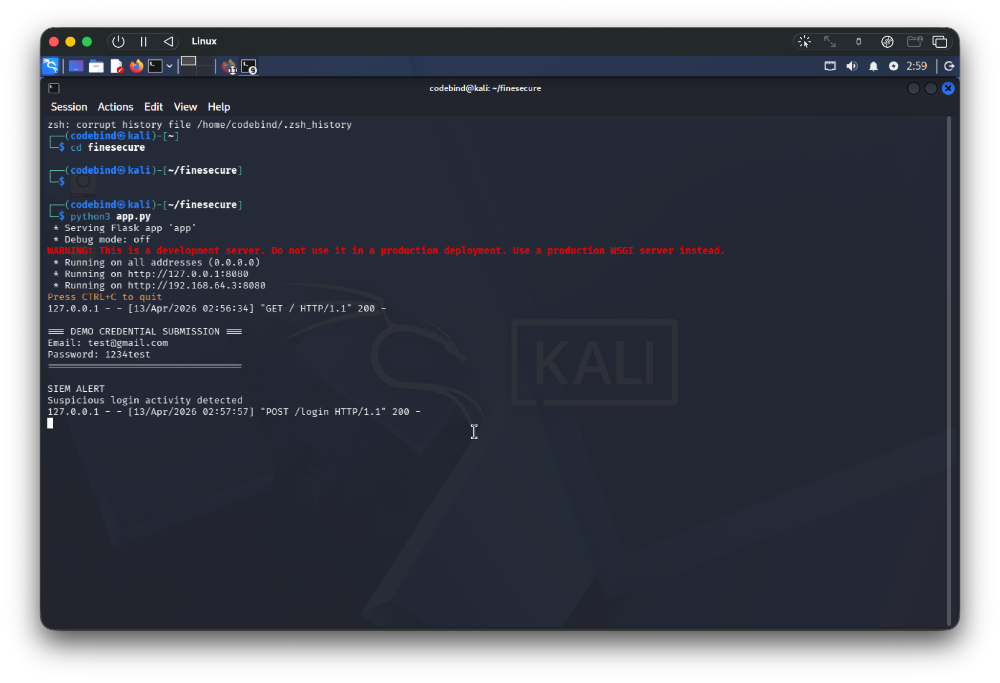
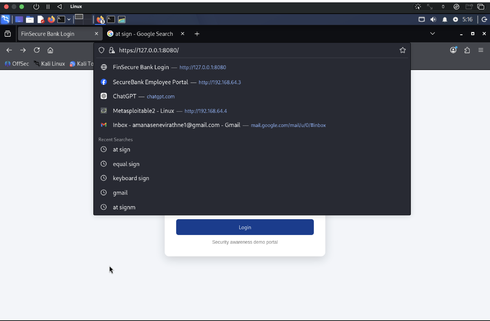
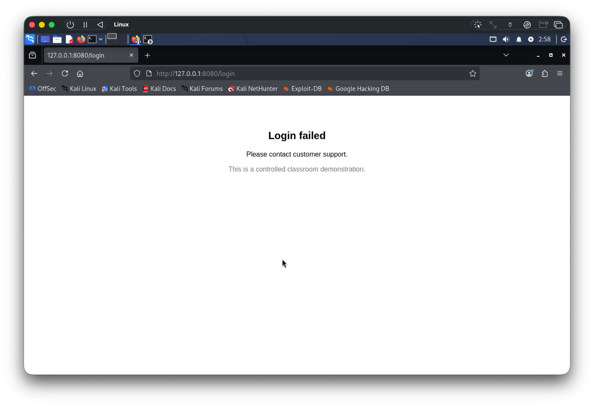
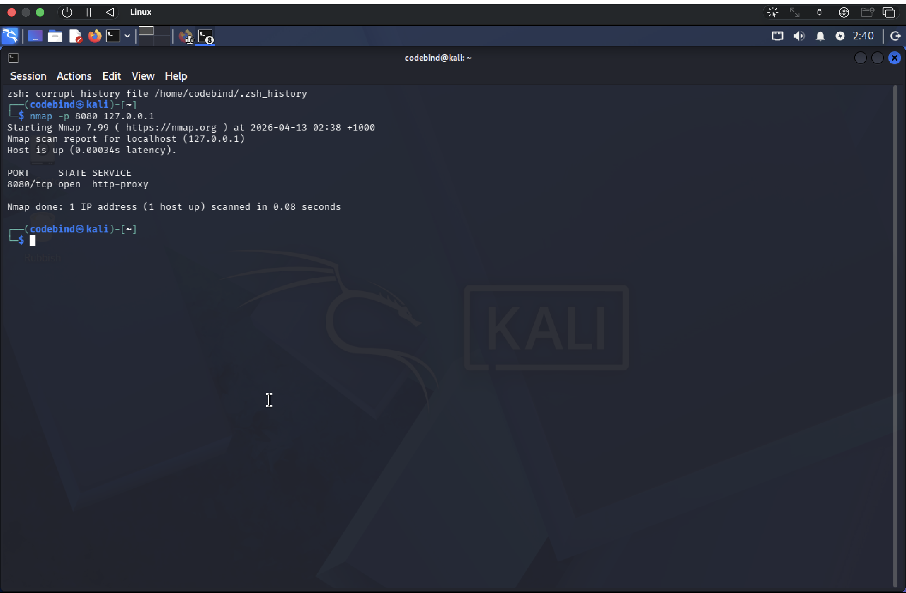

# Phishing Attack Simulation

## Overview
This project demonstrates how phishing attacks can capture user credentials in a simulated banking environment.

## Project Scenario
A fake FinSecure Bank login page was created using Flask to simulate credential harvesting. The project then applied multiple defensive controls to detect and prevent the attack.

## Tools Used
- Flask
- Kali Linux
- Wireshark
- Suricata
- iptables
- OpenSSL

## Attack Flow
Attacker → Phishing Page → Victim Login → Data Capture → IDS Alert → Firewall Block → HTTPS Secure

## Incident Analysis (SOC Perspective)

### Indicators of Compromise (IoCs)
- Suspicious HTTP POST request containing credentials
- Unencrypted traffic over port 80
- Repeated login attempts detected

### Detection
Suricata IDS generated alerts when suspicious login traffic was observed.

### Response
Firewall rules were applied to block access to the phishing server.

### Prevention
HTTPS encryption was implemented to protect credentials in transit.
Multi-Factor Authentication (MFA) is recommended.

## Real-World Banking Impact
This type of phishing attack can lead to unauthorized account access, financial fraud, and reputational damage.

## 📸 Project Screenshots

### 🔐 Firewall Block

### 🖥️ Flask Credential Capture

### 🔒 HTTPS Secure Page

### 📄 Login Result Page

### 🌐 Nmap Scan

